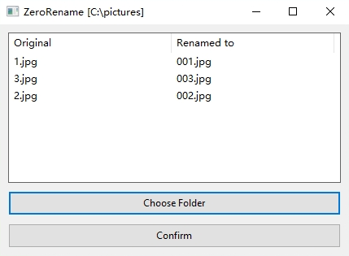

# Zero Rename

<div align="center">
   
</div>

Add leading zeros to numeric file names so that all of them have the same amount of digits, making the ASCII order of them identical to the numerical one.

## Download

- [Windows 64-bit](https://github.com/dec32/zero-rename/releases/download/v0.1/ZeroRename.exe)
- [Windows 64-bit (CLI version)](https://github.com/dec32/zero-rename/releases/download/v0.1/zr.exe)

## Screenshot

<div align="center">
    
</div>

## Usage

Notice: **This section is only for the CLI version**.

Assume you have a folder with files you want to rename:

```
C:/
└─ pictures/
   ├─ 1.jpg
   ├─ 2.jpg
   ├─ 3.jpg
   └─ 100.jpg
```

Use command `zr` to enter the interactive command-line interface. Input in the path and press enter to confirm as suggested. The console is now like:

```
Input the parent folder(or left empty to quit the program):
C:\pictures
Preview:
| Original | New     |
|----------|---------|
| 1.jpg    | 001.jpg |
| 2.jpg    | 002.jpg |
| 3.jpg    | 003.jpg |
Press Enter to confirm the renaming...

Renamed files in [C:\Users\Administrator\Documents\test] successfully.
Input the parent folder(or left empty to quit the program):
```

Press enter again to quit the program. Now the folder is like: 

```
C:/
└─ pictures/
   ├─ 001.jpg
   ├─ 002.jpg
   ├─ 003.jpg
   └─ 100.jpg
```

You can also use paths as arguments to rename the files in them. In the given example above, the command will be `zr C:\pictures`. When passing in paths, there won't be any interaction from the program unless errors occur.
